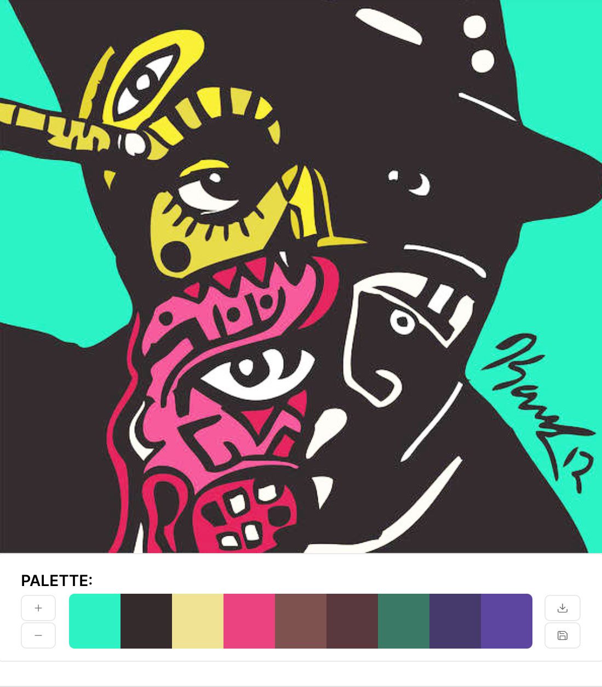
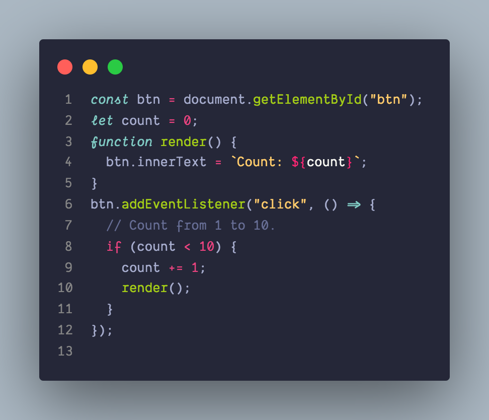
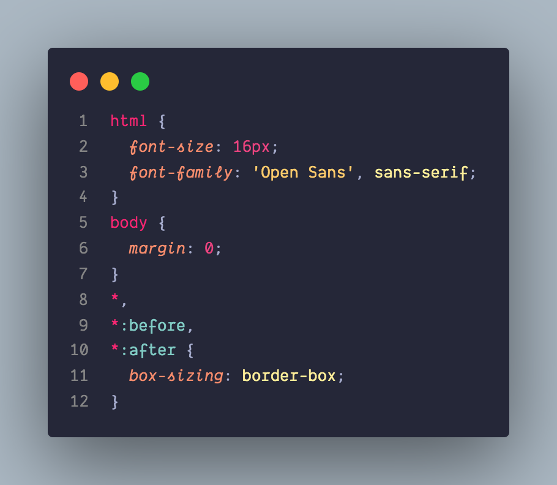
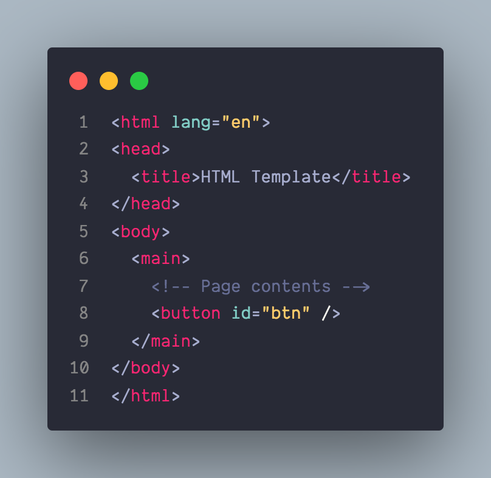

# MosDev Theme

VSCode dark theme inspired by this poster of my favorite rapper and and Monokai pro theme [Monokai Pro](https://marketplace.visualstudio.com/items?itemName=monokai.theme-monokai-pro-vscode) theme. .

## Installing

This extension is available for free in the [Visual Studio Code Marketplace](https://marketplace.visualstudio.com/items?itemName=MosDev.MosDev-Theme)

## SCREENSHOTS

### inspiration

### JavaScript

### Css

### HTML

### Custom Font

I am using Dank Mono, if you like you can support the author and purchase it here: [Dank Mono ](https://philpl.gumroad.com/l/dank-mono) font.

### Credits
[Monokai Pro](https://marketplace.visualstudio.com/items?itemName=monokai.theme-monokai-pro-vscode) theme.

[Mos Def Poster]
[by Kamoni Khem](https://fineartamerica.com/featured/mos-def-kamoni-khem.html?product=poster)

Enjoy.
